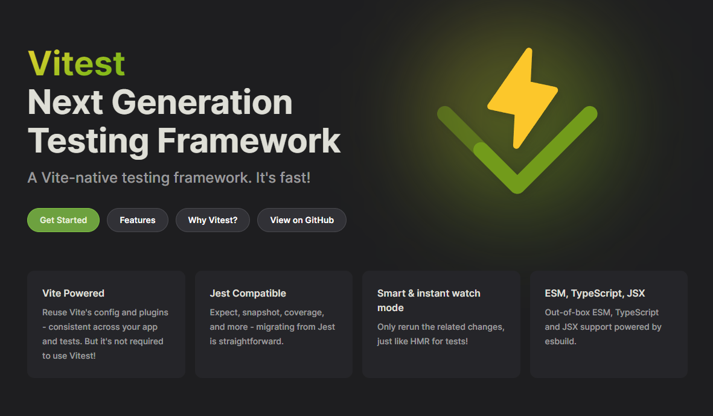

<h1 align="center"> Projeto para Vitest </h1>

Estudos para avaliar opção de bibioteca de teste unitários e teste de use cases com Node.js.  

  <a href="#-tecnologias">Tecnologias</a>&nbsp;&nbsp;&nbsp;|&nbsp;&nbsp;&nbsp;
  <a href="#-projeto">Projeto</a>&nbsp;&nbsp;&nbsp;|&nbsp;&nbsp;&nbsp;
  <a href="#memo-licença">Licença</a>

 

  

## 🚀 Tecnologias

Esse projeto foi desenvolvido com as seguintes tecnologias:

- Node 
- Typescript
- Git e Github
- Vitest

## 💻 Projeto

O projeto foi feito com o objetivo de avaliar possibilidade de utilização da biblioteca Vitest para testes unitários em Node JS com Typescript.
